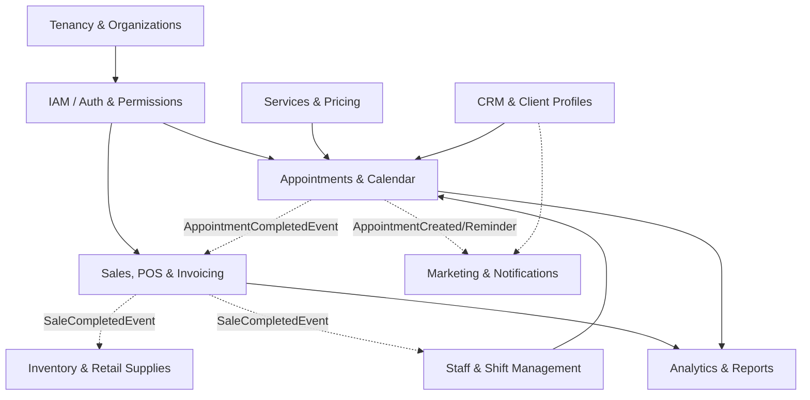
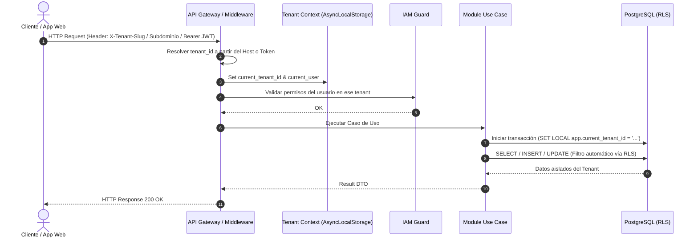
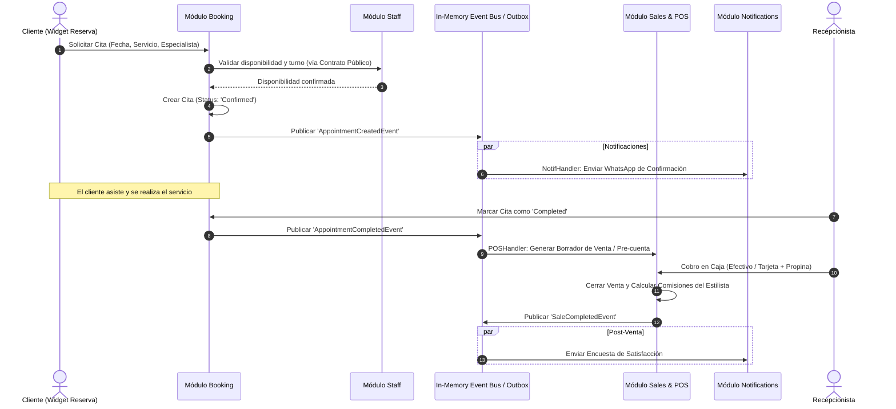

# Glowlab Platform — Arquitectura Técnica de Monolito Modular

> **Versión:** 1.0.0  
> **Estado:** Propuesta de Arquitectura y Diseño Técnico  
> **Ámbito:** Plataforma SaaS Multi-Tenant para Salones de Belleza, Barberías y Centros de Estética  
> **Fecha:** 2026-08-10  

---

## 1. Resumen Ejecutivo y Visión del Sistema

**Glowlab** es una plataforma SaaS B2B (*Software as a Service*) multi-tenant diseñada integralmente para la gestión operativa, comercial y analítica de salones de belleza, barberías, spas y clínicas de estética. 

El modelo de negocio requiere atender desde negocios individuales (unilocal / autónomos) hasta cadenas y franquicias multisede, garantizando:
- **Aislamiento estricto de datos** por tenant (cada salón/franquicia opera en un entorno seguro y aislado).
- **Rendimiento y concurrencia en tiempo real** para agendamiento, gestión de turnos y sincronización de calendarios.
- **Escalabilidad y mantenibilidad** mediante una base de código desacoplada que permita evolucionar funcionalidades complejas (facturación, comisiones, POS, CRM, WhatsApp Bot) sin generar deuda técnica ni fricción entre equipos.

### Decisión de Arquitectura: Monolito Modular con Clean Architecture

Para maximizar la velocidad de desarrollo (*time-to-market*), minimizar la sobrecarga operativa y mantener una separación de dominios impecable, se adopta un **Monolito Modular** estructurado bajo los principios de **Clean Architecture (Hexagonal / Puertos y Adaptadores)** y **Domain-Driven Design (DDD)** táctico.

```
+-----------------------------------------------------------------------------------+
|                                  GLOWLAB MONOLITH                                 |
|                                                                                   |
|  +---------------------+   +---------------------+   +---------------------+      |
|  |     IAM Module      |   |   Tenancy Module    |   |   Services Module   |      |
|  | (Clean Architecture)|   | (Clean Architecture)|   | (Clean Architecture)|      |
|  +----------+----------+   +----------+----------+   +----------+----------+      |
|             |                         |                         |                 |
|             +-------------------------+-------------------------+                 |
|                                       | (Domain Events / Public Contracts)        |
|  +---------------------+   +----------v----------+   +---------------------+      |
|  |  Booking & Calendar |   |    Sales & POS      |   |   Inventory Module  |      |
|  | (Clean Architecture)|   | (Clean Architecture)|   | (Clean Architecture)|      |
|  +---------------------+   +---------------------+   +---------------------+      |
|                                                                                   |
|  +-----------------------------------------------------------------------------+  |
|  |                     Shared Kernel & Cross-Cutting Core                      |  |
|  | (Multi-Tenant Context, Event Bus, Result/Either, Outbox, DB RLS, Security)   |  |
|  +-----------------------------------------------------------------------------+  |
+-----------------------------------------------------------------------------------+
```

---

## 2. Principios de Arquitectura y Reglas de Diseño

1. **Aislamiento de Módulos (High Cohesion, Loose Coupling):**
   - Cada módulo representa un *Bounded Context* de negocio.
   - La persistencia de datos de cada módulo está estrictamente encapsulada. **Ningún módulo puede hacer JOINs o consultas directas a tablas de otro módulo**.
   - La comunicación inter-módulo es síncrona solo a través de **Interfaces/Contratos Públicos (Facade/Public API DTOs)** o asíncrona mediante un **Bus de Eventos de Dominio (Domain Events)**.

2. **Clean Architecture dentro de cada Módulo:**
   - La regla de dependencia es absoluta: **Las capas internas no conocen a las capas externas**.
   - `Domain` (núcleo puro) -> `Application` (casos de uso) -> `Infrastructure` (adaptadores de base de datos, servicios externos) -> `Presentation` (controladores HTTP/GraphQL, workers).

3. **Multi-Tenancy por Diseño:**
   - Todo dato de negocio pertenece a un `tenant_id`.
   - La resolución de tenant ocurre a nivel de middleware/pipeline de entrada (Subdomain, Header o JWT claim).
   - Inyección de contexto de tenant mediante `AsyncLocalStorage` (o equivalente de contexto de ejecución) asegurando que el aislamiento sea automático y transparente para la capa de aplicación.

4. **Transacciones y Consistencia Eventual:**
   - Transacciones ACID locales dentro de un mismo módulo.
   - Para operaciones que involucran múltiples módulos (ej. Finalizar Cita -> Generar Venta -> Descontar Inventario -> Liquidar Comisión), se utiliza el patrón **Transactional Outbox** y eventos de dominio para consistencia eventual.

---

## 3. Descomposición de Dominios (Bounded Contexts)

La plataforma se divide en 9 módulos funcionales y 1 núcleo compartido (*Shared Kernel*):



### 3.1. `Tenancy & Organizations` (Gestión de Salones y Sedes)
- **Responsabilidad:** Registro de salones (tenants), configuración empresarial, gestión multisede/sucursales (*branches/locations*), horarios de atención generales, zonas horarias, divisas, configuración de branding y planes de suscripción (SaaS Billing).
- **Entidades Principales:** `Tenant`, `Organization`, `Location` (Sede), `BusinessHours`, `TenantSubscription`, `Plan`.

### 3.2. `IAM` (Identidad, Autenticación y Control de Acceso)
- **Responsabilidad:** Autenticación multi-tenant, emisión de JWT/sesiones seguras, gestión de usuarios (dueño, administrador, recepcionista, estilista, cliente), asignación de roles y permisos basados en RBAC (*Role-Based Access Control*).
- **Entidades Principales:** `User`, `Role`, `Permission`, `UserTenantMembership`, `Session`, `ApiKey`.

### 3.3. `Catalog & Services` (Catálogo de Servicios y Precios)
- **Responsabilidad:** Catálogo de servicios ofrecidos (corte, tinte, manicure, tratamientos capilares), duración base, tiempo de procesamiento/espera, tiempos de limpieza/buffer, tarifas por sede, categorías, combos/paquetes de servicios y recursos requeridos (sillones especiales, cabinas de spa).
- **Entidades Principales:** `Service`, `Category`, `ServiceVariant`, `ServiceCombo`, `ResourceRequirement`.

### 3.4. `Staff & Scheduling` (Especialistas, Turnos y Disponibilidad)
- **Responsabilidad:** Perfil del personal/estilistas, habilidades/servicios que realiza cada profesional, horarios de trabajo individuales, pausas/bloqueos, vacaciones, excepciones de agenda y esquema de comisiones base.
- **Entidades Principales:** `StaffMember`, `StaffSkill`, `ShiftSchedule`, `TimeOffRequest`, `ScheduleBlock`, `CommissionProfile`.

### 3.5. `Appointments & Booking` (Agendamiento y Calendario en Tiempo Real)
- **Responsabilidad:** Motor de reserva de citas, cálculo algorítmico de disponibilidad en tiempo real (evitando solapamientos de estilista y recursos físicos), flujo de reserva para clientes (portal web/widget) y panel de recepción, máquina de estados de la cita (*Draft, Pending, Confirmed, InProgress, Completed, Cancelled, NoShow*).
- **Entidades Principales:** `Appointment`, `AppointmentItem`, `AppointmentStatusHistory`, `BookingSlot`, `CancellationPolicy`.

### 3.6. `Customers & CRM` (Clientes, Ficha Técnica e Historial)
- **Responsabilidad:** Directorio de clientes por tenant/sede, historial completo de visitas, notas y fichas técnicas confidenciales (fórmulas de colorimetría, alergias, tipo de cabello/piel), programa de fidelización y puntos.
- **Entidades Principales:** `Customer`, `CustomerProfile`, `TechnicalRecord` (Ficha Técnica / Tintes), `LoyaltyBalance`, `CustomerTag`.

### 3.7. `Sales, POS & Invoicing` (Punto de Venta, Caja, Comisiones y Facturación)
- **Responsabilidad:** Cobro en caja (*checkout*), apertura y cierre de caja chica/turnos de caja (*cash register sessions*), múltiples medios de pago (efectivo, tarjeta, transferencia, monedero digital), cálculo automático y liquidación de comisiones de estilistas por servicio y producto, generación de comprobantes y facturación electrónica.
- **Entidades Principales:** `SaleOrder`, `SaleItem`, `Payment`, `CashRegisterSession`, `CommissionAccrual`, `Invoice`.

### 3.8. `Inventory & Supplies` (Inventario de Retail e Insumos Internos)
- **Responsabilidad:** Control de stock de productos para venta directa (champús, ceras) y productos de uso interno/gasto en cabina (tintes, oxidantes, toallas desechables), transferencias entre sedes, proveedores, alertas de stock mínimo y registro de mermas.
- **Entidades Principales:** `Product`, `ProductCategory`, `StockLevel`, `StockMovement`, `Supplier`, `PurchaseOrder`.

### 3.9. `Marketing & Notifications` (Comunicaciones y Recordatorios)
- **Responsabilidad:** Envío de confirmaciones y recordatorios automatizados de citas vía WhatsApp (Cloud API/Bot), SMS y Email; campañas de reactivación de clientes inactivos y encuestas de satisfacción post-servicio.
- **Entidades Principales:** `NotificationTemplate`, `NotificationLog`, `Campaign`, `MessagingChannel`.

### 3.10. `Analytics & Reporting` (Métricas y Business Intelligence)
- **Responsabilidad:** Dashboards de facturación diaria, ocupación de sillones/estilistas, ticket promedio, servicios más rentables, retención de clientes y reportes contables/financieros exportables.
- **Entidades Principales:** Vistas materializadas y proyecciones de analítica (*Read Models*).

---

## 4. Anatomía de un Módulo (Clean Architecture)

Cada módulo dentro del monolito sigue exactamente la misma estructura interna de 4 capas:

```
[backend/src/modules/<module-name>]
│
├── domain/                      <-- CAPA DE DOMINIO (Independiente de frameworks/DB)
│   ├── entities/                # Entidades con lógica y reglas de invariantes
│   ├── value-objects/           # Objetos de valor inmutables (ej. Money, TimeSlot, Email)
│   ├── events/                  # Eventos de dominio producidos (ej. AppointmentBookedEvent)
│   ├── exceptions/              # Errores y excepciones semánticas de dominio
│   └── repositories/            # Interfaces/Puertos de repositorios (sin implementación)
│
├── application/                 <-- CAPA DE APLICACIÓN (Casos de uso y orquestación)
│   ├── use-cases/               # Comandos y Consultas (ej. CreateAppointmentUseCase)
│   ├── dtos/                    # DTOs de entrada y salida de los casos de uso
│   ├── event-handlers/          # Manejadores de eventos de dominio locales o de otros módulos
│   └── ports/                   # Interfaces para servicios externos o adaptadores necesarios
│
├── infrastructure/              <-- CAPA DE INFRAESTRUCTURA (Detalles de tecnología)
│   ├── persistence/             # Mapeo ORM/Tablas, repositorios que implementan los puertos
│   │   ├── entities/            # Esquemas de base de datos / Mappers
│   │   └── repositories/        # Implementación concreta del repositorio (Postgres/Prisma/TypeORM)
│   ├── adapters/                # Clientes de APIs externas, pasarelas, almacenamiento
│   └── services/                # Servicios técnicos específicos del módulo
│
└── presentation/                <-- CAPA DE PRESENTACIÓN / CONTROLADORES
    ├── http/                    # Controladores REST / Fastify / Express / NestJS
    │   ├── controllers/         # Endpoints HTTP
    │   ├── requests/            # Validación de esquemas de entrada (Zod / DTOs)
    │   └── responses/           # Serialización de respuestas HTTP
    └── events/                  # Suscriptores de eventos de colas / workers
```

---

## 5. Shared Kernel y Mecanismos Transversales

El `Shared Kernel` contiene únicamente primitivas compartidas, abstracciones fundamentales y utilidades comunes:

```
backend/src/shared/
├── domain/
│   ├── aggregate-root.base.ts
│   ├── entity.base.ts
│   ├── value-object.base.ts
│   ├── domain-event.base.ts
│   ├── result.ts (Pattern Result / Either para manejo funcional de errores)
│   └── value-objects/ (TenantId, Money, DateRange, PhoneNumber)
├── application/
│   ├── use-case.interface.ts
│   ├── event-bus.interface.ts
│   └── pagination.dto.ts
├── infrastructure/
│   ├── database/
│   │   ├── tenant-connection.manager.ts
│   │   ├── base.repository.ts
│   │   └── transaction-manager.ts
│   ├── event-bus/
│   │   └── in-memory-event-bus.ts (o EventEmitter2 / BullMQ)
│   ├── outbox/
│   │   ├── outbox.entity.ts
│   │   └── outbox-processor.ts
│   └── telemetry/ (Logger Winston/Pino, OpenTelemetry, Metrics)
└── presentation/
    ├── middlewares/
    │   ├── tenant-resolver.middleware.ts
    │   ├── auth-guard.middleware.ts
    │   └── error-handler.middleware.ts
    └── utils/
```

### 5.1. Reglas de Comunicación Inter-Módulo

Para evitar que el monolito se convierta en un "espagueti" acoplado:
1. **Contratos Públicos (`public-api.ts`):** Cada módulo exporta únicamente un conjunto de interfaces, DTOs y una fachada (*Service Interface*) accesible por otros módulos.
2. **Event-Driven por Defecto:** Si el Módulo A necesita notificar al Módulo B de una acción (ej. Cita Finalizada -> Crear Orden en POS), emite un `DomainEvent` a través del Event Bus.
3. **Cero Dependencias Circulares:** Las dependencias entre módulos deben ser acíclicas (`Module A -> Module B`, nunca `Module B -> Module A`).

---

## 6. Estrategia de Multi-Tenancy

### 6.1. Modelo de Base de Datos: Esquema Compartido con Aislamiento por `tenant_id` + Row Level Security (RLS)

- **Patrón Adoptado:** *Shared Database, Shared Schema with Logical Isolation & Row-Level Security (PostgreSQL)*.
- **Justificación:** Es el modelo más costo-eficiente, fácil de mantener y migrar para un SaaS B2B en etapa de crecimiento, mientras que **PostgreSQL RLS** garantiza que a nivel de motor de base de datos ningún query pueda acceder a datos de otro tenant por error humano o fallo de software.

```sql
-- Ejemplo conceptual de PostgreSQL Row-Level Security por Tenant
ALTER TABLE appointments ENABLE ROW LEVEL SECURITY;

CREATE POLICY tenant_isolation_policy ON appointments
    FOR ALL
    USING (tenant_id = current_setting('app.current_tenant_id')::uuid);
```

### 6.2. Ciclo de Vida de la Petición Multi-Tenant



---

## 7. Flujo Crítico de Negocio: Agendamiento y Liquidación



---

## 8. Estructura de Carpetas Propuesta para el Repositorio

A continuación se detalla la organización completa del repositorio monorepo/workspace para albergar la arquitectura propuesta:

```
glowlab-platform/
│
├── .github/                           # CI/CD Workflows (Lint, Test, Build, Deploy)
│   └── workflows/
│       ├── backend-ci.yml
│       └── frontend-ci.yml
│
├── docs/                              # Documentación Técnica y de Negocio
│   ├── architecture.md                # [Este documento] Arquitectura de Monolito Modular
│   ├── domain-model.md                # Diccionario de entidades, invariantes y estados
│   ├── api-specs.md                   # Contratos de API REST / OpenAPI
│   └── multitenancy.md                # Guía de aislamiento, seguridad y RLS
│
├── backend/                           # Backend: Monolito Modular en Node.js/TypeScript
│   ├── src/
│   │   ├── modules/                   # Módulos de Dominio (Bounded Contexts)
│   │   │   ├── tenancy/               # Salones, Sedes, Configuración, Suscripciones
│   │   │   ├── iam/                   # Auth, Usuarios, Roles, Permisos RBAC
│   │   │   ├── catalog/               # Servicios, Categorías, Variantes, Precios
│   │   │   ├── staff/                 # Estilistas, Turnos, Disponibilidad, Bloqueos
│   │   │   ├── appointments/          # Motor de Agendamiento, Calendario, Reservas
│   │   │   ├── customers/             # CRM, Fichas Técnicas, Historial de Clientes
│   │   │   ├── pos/                   # Ventas, Caja Chica, Comisiones, Pagos
│   │   │   ├── inventory/             # Stock Retail, Insumos Internos, Proveedores
│   │   │   ├── notifications/         # WhatsApp Cloud API, Email, SMS, Plantillas
│   │   │   └── analytics/             # Métricas, Reportes Financieros, Dashboards
│   │   │
│   │   ├── shared/                    # Shared Kernel y Cross-Cutting Concerns
│   │   │   ├── domain/                # Base Entity, Value Objects, Result Pattern
│   │   │   ├── application/           # Interfaces de Bus, Puertos Comunes
│   │   │   ├── infrastructure/        # Postgres RLS, Outbox Processor, Logger
│   │   │   └── presentation/          # Tenant Middleware, Auth Guard, Error Filter
│   │   │
│   │   ├── app.ts                     # Configuración y Registro de Módulos (Fastify/Express)
│   │   └── server.ts                  # Punto de Entrada del Servidor HTTP y Workers
│   │
│   ├── tests/                         # Pruebas Automatizadas
│   │   ├── unit/                      # Pruebas Unitarias de Dominio y Casos de Uso
│   │   ├── integration/               # Pruebas de Integración con Postgres RLS
│   │   └── e2e/                       # Pruebas End-to-End de Flujos Completos
│   ├── prisma/ o drizzle/             # Esquemas de Base de Datos y Migraciones
│   ├── package.json
│   └── tsconfig.json
│
├── frontend/                          # Frontend: Aplicación Web Moderna (Next.js / Vite)
│   ├── src/
│   │   ├── apps/
│   │   │   ├── admin-portal/          # Panel de Gestión para Dueños y Recepcionistas
│   │   │   ├── specialist-portal/     # App Móvil/Web para Estilistas (Agenda y Comisiones)
│   │   │   └── booking-widget/        # Widget Embebible / Portal Público de Reservas
│   │   ├── shared-ui/                 # Design System (Tailwind/CSS Tokens, Componentes UI)
│   │   └── core/                      # Clientes API, Auth State, Multi-Tenant Session
│   ├── package.json
│   └── tsconfig.json
│
├── infrastructure/                    # Infraestructura como Código y Despliegue
│   ├── docker/
│   │   ├── Dockerfile.backend
│   │   ├── Dockerfile.frontend
│   │   └── Dockerfile.worker
│   ├── local/                         # Scripts de Inicialización Local (DB Seeds, RLS scripts)
│   └── k8s-or-terraform/              # Manifiestos de Producción / Staging
│
├── docker-compose.yml                 # Entorno Local: Postgres 16, Redis 7, Mailpit, MinIO
├── .gitignore
└── README.md
```

---

## 9. Stack Tecnológico Recomendado y Justificación

| Capa / Componente | Tecnología Seleccionada | Justificación Técnica |
| :--- | :--- | :--- |
| **Lenguaje Backend** | **TypeScript / Node.js (v20+ LTS)** | Tipado estricto para DDD, ecosistema unificado con Frontend, soporte asíncrono de alto rendimiento. |
| **Framework HTTP** | **Fastify** (o NestJS Modular) | Extremadamente rápido, bajo *overhead*, excelente soporte para plugins/módulos y validación con esquemas JSON/Zod. |
| **Base de Datos Principal**| **PostgreSQL 16** | Soporte robusto de **Row-Level Security (RLS)** nativo, JSONB para fichas técnicas dinámicas y transacciones ACID. |
| **ORM / Query Builder** | **Drizzle ORM** o **Prisma** | Drizzle permite control SQL explícito con soporte transparente de RLS y cero *overhead*; Prisma ofrece migraciones declarativas y tipado automático. |
| **Caché y Colas** | **Redis + BullMQ** | Caché de disponibilidad de turnos, semáforos/locks distribuidos para evitar doble-reserva simultánea y colas de background jobs (Outbox, WhatsApp). |
| **Frontend Framework** | **Next.js 15 (App Router)** | Renderizado híbrido (SSR para portal público de reservas / SEO + SPA reactiva para el panel administrativo con React Server Components). |
| **Estilos y UI** | **Tailwind CSS + Radix UI (Shadcn/UI)** | Consistencia visual, diseño accesible (a11y), temas claro/oscuro personalizables por salón (*white-label / branding*). |
| **Comunicaciones** | **Meta WhatsApp Cloud API + Resend (Email)** | Canal preferido por salones en Latinoamérica y Europa para recordatorios automáticos y confirmación inmediata. |

---

## 10. Consideraciones de Seguridad, Aislamiento y Cumplimiento

1. **Prevención de Fuga de Datos Multi-Tenant:**
   - Pruebas automatizadas de integración que verifican explícitamente que un usuario del Tenant A no pueda leer ni mutar registros del Tenant B, incluso manipulando IDs en peticiones HTTP.
   - Forzado de clave foránea compuesta `(id, tenant_id)` en tablas relacionales.
2. **Confidencialidad de Fichas Técnicas y Datos Médicos/Estéticos:**
   - Encriptación en reposo para notas de colorimetría y fórmulas químicas de clientes.
   - Registro de auditoría (*Audit Trail*) para trazabilidad de modificaciones en citas y cajas de dinero.
3. **Control de Concurrencia Optimista / Pesimista:**
   - Bloqueo transaccional o Redis Mutex en el momento exacto de confirmar un `BookingSlot` para impedir que dos clientes reserven el mismo estilista y horario en el mismo milisegundo.

---

## 11. Estrategia de Evolución Futura (Hacia Microservicios si aplica)

Gracias a los límites estrictos del **Monolito Modular**:
- Si en el futuro el módulo de **`Appointments & Booking`** o **`Notifications`** experimenta picos masivos de tráfico que requieran escalado independiente, puede extraerse a un microservicio autónomo en cuestión de días, ya que su base de datos está desacoplada, sus dependencias están definidas por puertos y su comunicación es mediante eventos de dominio.
- Mientras tanto, el equipo mantiene **cero complejidad de red, un solo pipeline de despliegue, refactorizaciones seguras con TypeScript y máxima velocidad de iteración**.
